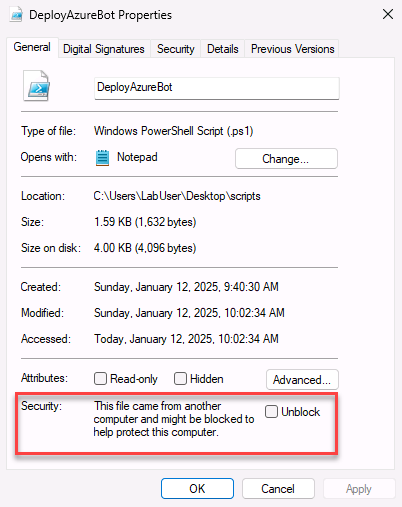
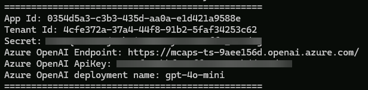

# Prerequisites
To perform this lab, you will need the following requirements:

- [Visual Studio 2022](https://visualstudio.microsoft.com/vs/) with the following workloads:
  - ASP.NET and web development
  - Azure development
- [Azure CLI](https://docs.microsoft.com/cli/azure/install-azure-cli)
- [An Azure subscription](https://azure.microsoft.com/)

If you're doing this lab at MCAPS Tech Connect, the environment is already set up for you. 
However, you will need to download the lab files from the GitHub repository first and then provision the required resources on your Azure subscription. Let's start with the first task:

1. Open the browser and navigate [to the following URL](https://github.com/microsoft/MCAPSTechConnect2024-lab214/archive/refs/heads/main.zip)
2. Download the ZIP file to your computer and extract in the *C:\src* folder of the computer.

The next step is to run a PowerShell script, which is going to deploy on your Azure subscription the two resources which are needed to run the lab:

- An Azure Bot Service resource, with the corresponding app registration on Microsoft Entra
- An Azure OpenAI resource

To run the script, perform the following steps:

1. Double click on the **scripts** folder in the extracted folder.
2. Right click on the **DeployAzureBot.ps1** file and click **Properties**.
3. At the bottom of the window, in the **Security** section, check the **Unblock** checkbox and click **OK**.

    

4. Right click on an empty space in File Explorer and choose **Open in Terminal**.
5. Type the following command to enable the execution of the script:

    ```powershell
    Set-ExecutionPolicy -ExecutionPolicy Unrestricted -Scope Process
    ```

6. Run the script by typing the following command:

    ```powershell
    .\DeployAzureBot.ps1
    ```

7. The script will ask you to log in to your Azure subscription. If you're doing this lab at MCAPS Tech Connect, use the following credentials when asked:

    - Username: +++@lab.CloudPortalCredential(User1).Username+++
    - Password: +++@lab.CloudPortalCredential(User1).Password+++

8. Once the script has completed the execution, you will see a report like the following one:

    

9. Open Notepad and copy all the values from the output. You will need them later in the lab.

